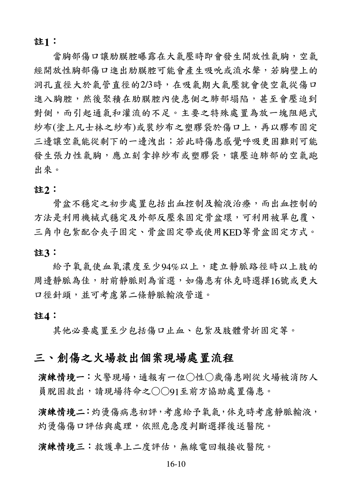

# 第十六章 各種急症與創傷的情境演練與複習

## 第一節

## 第二節

### 一、肢體無力疑似中風處置流程

### 二、缺血性胸痛併心臟停止處置流程

### 三、發燒病人緊急救護處置流程

## 第三節

### 一、創傷之危急個案現場處置流程

### 二、重大車禍多重創傷病患緊急救護處置流程

### 三、創傷之火場救出個案現場處置流程

### 四、胸腹部創傷病患緊急救護處置流程

## 第四節

